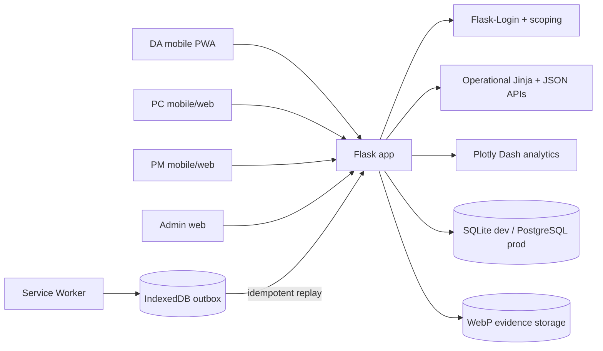

# Architecture — Model Village SaaS

## Shape

The system remains a modular Flask monolith: one deployment and one transactional relational
database, with role-adaptive Jinja/vanilla-JS operational pages and Plotly Dash analytics.

## Domain boundaries

- Master data: PM, PC, DA, Village, Committee, CommitteeMember.
- Monthly planning: ActionPlan occurrences plus Excel transfer staging.
- Field execution: Attendance/Specials with evidence and offline idempotency.
- Monitoring/reporting: role-scoped summaries, full report detail, exports, map and profiles.
- Administration: user lifecycle, master-data CRUD/transfer, audit and recycle bin.

## Trust boundaries

Browser input, Excel imports, filenames, IDs and GPS coordinates are untrusted. Authentication and
authorization are separate. Every resource lookup is scoped server-side; bulk imports are rebound to
the authenticated exporter and revalidated at confirmation. Photo bytes are decoded and re-encoded
rather than trusted by extension/MIME alone.

## Monthly consistency model

The monthly ActionPlan occurrence is the reporting/scheduling source of truth. A unique
`(committee_id, plan_month)` prevents duplicate occurrences. A submitted Attendance or Specials row
is unique per plan. PC schedule history becomes immutable after completion/due date/past month.

Prepare Next Month creates new rows rather than mutating the previous month. This is the core
mechanism behind immutable monthly history.

## Bulk import transaction model

Both monthly planning import and Admin master-data import use:

Export → edit → Upload → Validate → Preview → Confirm → Transaction → Audit

No database mutation occurs at Preview. Confirm revalidates the staged workbook before writing.
Any database failure rolls back the transaction.

## UI architecture

Bento Grid + Minimalism is the application shell. Phone routes use role-specific bottom navigation
and card/detail layouts; tablet/desktop use the side rail and dense tables where appropriate. Map has
a phone-friendly List alternative. Reports deliberately move dense evidence into a View detail page.

## Operations

Production remains PostgreSQL + HTTPS behind a reverse proxy. Upload storage must be durable/shared before
horizontal scaling. Database and evidence backups are treated as one recovery set. Run the recycle-bin
purge on a schedule only after backup health is verified.
