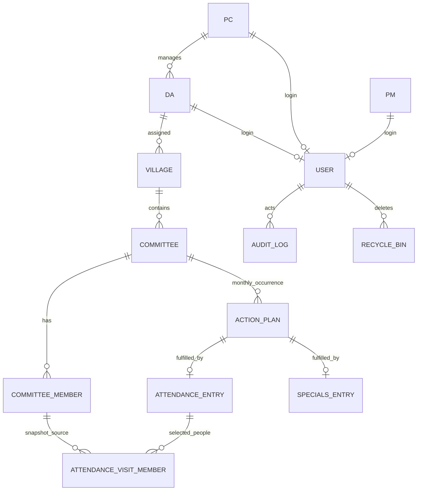

# Data Model — SaaS Rebuild

The application has 13 physical tables. Lifecycle-managed domain tables carry `is_enabled`,
`is_deleted`, `deleted_at`, `created_at` and `updated_at`.

## Hierarchy invariant

`PC.cluster` is the only persisted cluster assignment. DA derives cluster from `DA.pc_id`; Village
derives it from `Village.da_id -> DA.pc_id`. Committee, ActionPlan and field-entry scope derives from
the same chain.

## Master data

- `pms`: `full_name`, optional `email/mobile/notes`.
- `pcs`: `full_name`, `cluster` (`CSRB|PDTC`), optional contact/notes.
- `das`: `full_name`, `pc_id`, optional contact/notes.
- `villages`: `name`, optional stable `code`, GP/district/mandal, coordinates, `da_id`, notes.
- `committees`: `name`, optional `committee_type`, `village_id`, notes.
- `committee_members`: `committee_id`, `full_name`, gender, normalized designation, mobile, notes.

## Monthly ActionPlan

`action_plans` stores one committee occurrence per calendar month:

- `committee_id`
- `title`, optional `description`
- `plan_month` — first day of the month
- `plan_type` — `Attendance|Specials`
- `assigned_date`
- `assigned_by_user_id`
- `prepared_from_id` — source occurrence when using Prepare Next Month
- `notes`

Unique: `(committee_id, plan_month)`.

Legacy pre-rebuild template rows are retained with `plan_month=NULL` and are not executable.
A monthly plan is executable only when month, type and assigned date are all present. Type may be
pre-filled while date remains blank during next-month preparation.

## AttendanceEntry

One accepted Attendance submission per ActionPlan:

- village/committee/action-plan IDs
- `visit_date`
- live male/female counts
- server-controlled `total_count = male_count + female_count`
- `new_members_count`
- designation summary
- `status` (`Early|On-time|Postponed`)
- conditional reason, remarks
- WebP photo path, GPS coordinates/source
- submitting User
- unique `client_submission_id`
- submitted timestamp

`Failure` is not an AttendanceEntry status; it is derived from an overdue ActionPlan with no entry.

## AttendanceVisitMember

Stores the master members selected through Visit Designations:

- `attendance_entry_id`
- `committee_member_id`
- `member_name_snapshot`
- `designation_snapshot`
- `gender_snapshot`

Unique `(attendance_entry_id, committee_member_id)`. Snapshots make historical reports immutable when
master names/designations later change.

## SpecialsEntry

One accepted Specials submission per ActionPlan:

- village/committee/action-plan IDs
- event date
- title (currently defaults to Committee)
- participant count
- scope (`Under GP|Under VDC`)
- status/reason
- notes
- WebP photo + GPS
- submitting User + unique `client_submission_id`

The action-plan FK is nullable only for backward compatibility with pre-rebuild rows; new field
submissions always require an executable Specials ActionPlan.

## User

Authentication is deliberately separate from profile master data. A User has email/mobile,
password hash, role, display name, and exactly one of `pm_id|pc_id|da_id` for non-Admin roles.
Admin has none.

## Audit and recycle bin

Admin/PC plan changes and Admin master-data changes are audit logged. Master-data relationship
reassignments are `move` events. Soft deletion goes to the recycle-bin workflow and can be restored
until the configured purge retention expires.
